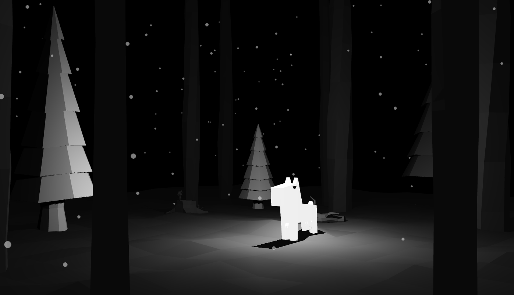

# dc-design-hackathon
I imported prepared by our designer scene.dae into three.js. And codeded:
 * Camera rotation
 * Camera angle change on mouse move
 * Snowflakes falling
 * Exponential fog to mask borders of scene
 * Programmed specifics of light and shadows in scene

# Screensaver
You can use [WebViewScreenSaver 2.0](https://github.com/liquidx/webviewscreensaver/releases) to display this animation while away from keyboard.

